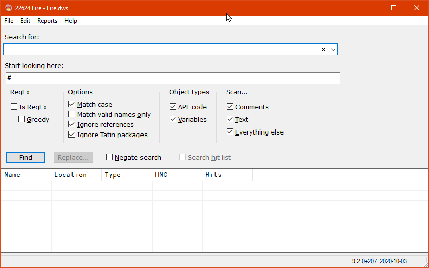
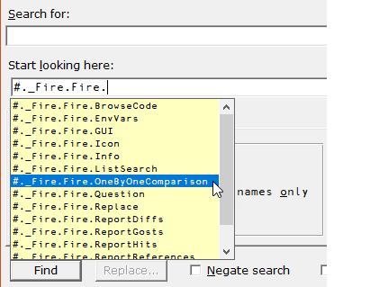
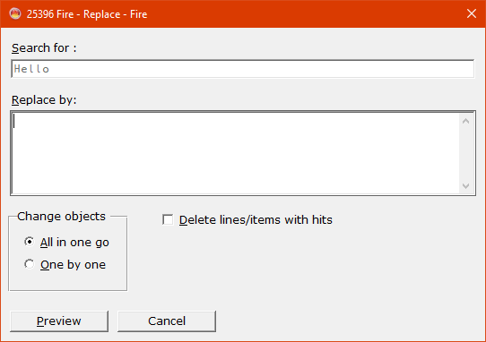
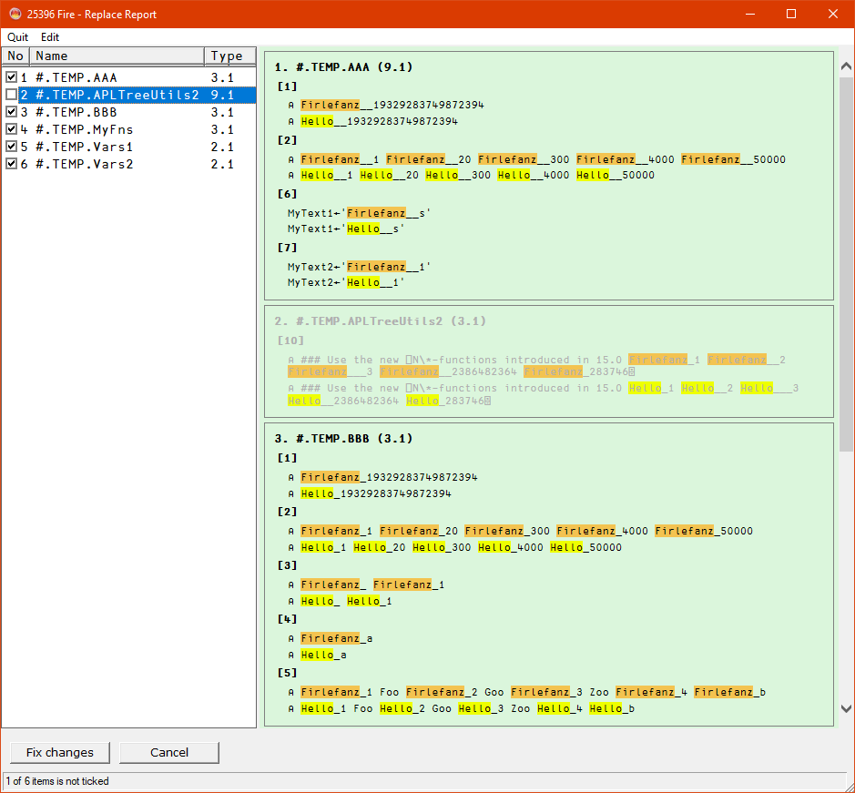
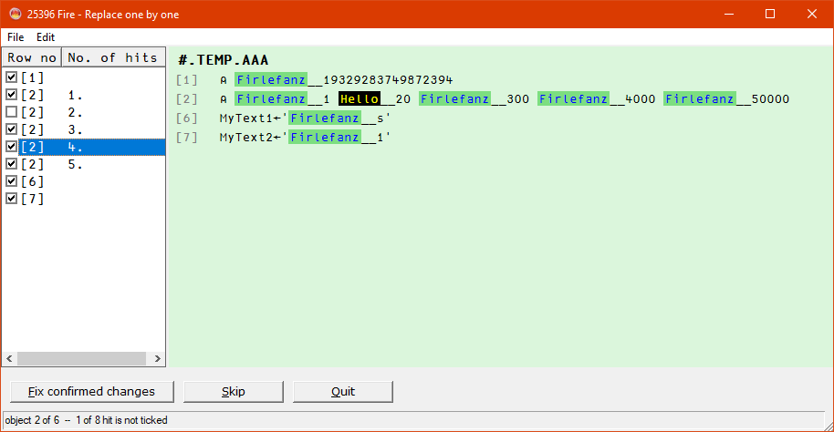

# Fire

 Fire stands for FInd and REplace. It's designed to search and replace strings in the workspace.

## Features

Fire's main feature is the "Replace" command which allows you in an easy yet powerful way to replace certain strings in all or selected objects.

Other features are:

* You can search either the workspace or just the list of names (`⎕NL`).

* You can search any combination of the APL source code; that's everything but stuff within quotes (text) and comments.

* Negate a search ("all objects that do **not** contain...").

* Search only the hits of the last search. 

## Difference between Dyalog's built-in Search tool and Fire

* Fire handles circular references correctly (thanks to PhilLast)

* Fire reports a WS FULL only when it is reasonable to do so 

## Fire's GUI

### Main Window

Specifying anything in the "Start looking here" control is supported by autocomplete: this box offers all ordinary namespaces matching the characters in "Start looking here".

After having performed a search one might want to look at the lines carrying the hits. This can be achieved by selecting the "Report hits" menu command from the "Report" menu:

The report offers a context menu on the items of the left:

### The "Replace" feature

The Replace feature allows you to change the workspace on a global level:

There are two modes available:

* "All in one go" allows you to check all changes first and then either accept or discard them.
* "One-by-one" allows you to compare and edit one object after the other. 

#### "All in one go" mode

When you select the "Preview" button you get this:

This allows you to check whether everything is okay or not. Here we see a "compressed" report: it contains only the lines which would change plus the object names plus the headers for all traditional functions and operators in order to make checking local variables easy. You cannot change anything at this stage but you can exclude certain objects from the "Replace" operation by un-ticking the check box.

This is the second and last step:

This allows you to either change and fix all objects or not.

#### One by one

In one-by-one mode you can check and edit a single object:

In the next step you can either fix the changes or skip this object and carry on with the next one or cancel the whole operation:

